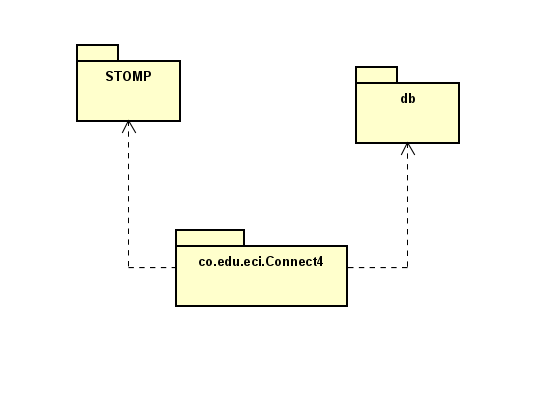

[](https://www.codacy.com/gh/Pokecris200/ProyectoARSW/dashboard?utm_source=github.com&amp;utm_medium=referral&amp;utm_content=Pokecris200/ProyectoARSW&amp;utm_campaign=Badge_Grade)

# Proyecto final ARSW

## Descripción

Connect4 KoH es un juego web que simula el famoso juego de mesa de Conecta 4  con la particularidad de que te permite jugar contra otros jugadores totalmente en linea en tiempo real

Puede acceder al proyecto aquí:
[](https://connect4arsw.herokuapp.com/)

### LOC/h

Para este taller se hicieron 797 líneas de código, en 50 horas.

**15.94 LOC/h**

### Prerrequisitos

Para correr este se debe tener instalado:

- Maven
- Java

### Guía de uso

Para compilar el proyecto se debe usar:

```
mvn package
```

Este le iniciará la página en su localhost con puerto 5000.

## Documentación

Para visualizar la documentación se debe ejecutar el siguiente comando:

```
mvn javadoc:javadoc
```

Una vez se realice este comando, se debe buscar en la siguiente ruta "target\site\apidocs\index.html".

## Estructura de Archivos

    .
    |____pom.xml
    |____src
    | |____main
    | | |____java
    | | | |____co
    | | | | |____edu
    | | | | | |____escuelaing
	| | | | | | |____connect4
	| | | | | | | |____db
	| | | | | | | |____stomp
	| | |____resources
	| | | |____static
	| | | | |____js
	| | | | |____styles
	| | | |____templates
	


## Autor

* **Cristian Forero** 
